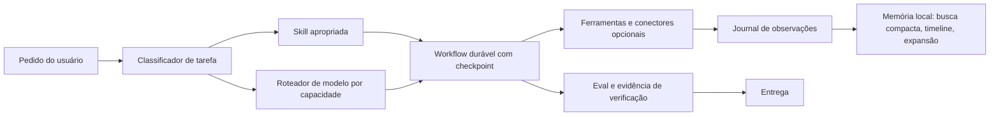

# Análise de referências para evolução da Athena

Data da revisão: 10 de agosto de 2026.

## Objetivo e método

Foram avaliados 25 alvos únicos: repositórios, perfis, organizações, páginas de
produto e bibliotecas de prompts. O repositório `henrydaum/second-brain` foi
enviado duas vezes e contado uma vez.

A avaliação separou cinco coisas que costumam ser confundidas:

1. recurso demonstrado em código e testes;
2. recurso descrito apenas no README;
3. ideia arquitetural reutilizável;
4. código legalmente reutilizável;
5. integração externa opcional que não deve virar dependência do núcleo.

Repositórios permissivos foram estudados em clone local. Projetos sem licença,
com licença não comercial ou serviços fechados foram usados somente como fonte
de ideias e requisitos; nenhum código ou prompt deles deve ser copiado para a
Athena.

### Cobertura verificável do código

O inventário integral foi executado sobre revisões Git fixadas de 23
repositórios. Cada arquivo rastreado foi lido em bytes e recebeu SHA-256; cada
arquivo textual foi percorrido linha a linha. Submódulos foram registrados pelo
commit apontado e links simbólicos pelo alvo armazenado no Git. O resultado:

- 39.590 arquivos rastreados;
- 38.989 arquivos textuais e 597 binários;
- 11.992.003 linhas de texto;
- 21.863 arquivos classificados como código autoral;
- 744 arquivos gerados ou dados em massa, 63 dependências vendorizadas, 13
  links simbólicos e 4 submódulos tratados separadamente;
- 558.077.139 bytes textuais e 814.662.544 bytes totais lidos.

O manifesto compacto `docs/AUDITORIA_REFERENCIAS_2026.json` preserva, para cada
repositório, URL, revisão, digest de cobertura, linguagens, extensões, licenças,
duplicatas exatas e contagens. Ele pode ser regenerado com
`core/scripts/audit_reference_repositories.py`. Binários, pesos, arquivos
gerados, lockfiles, traduções repetidas e dependências vendorizadas foram
verificados estruturalmente; não faria sentido alegar uma interpretação
semântica humana de bytes de modelo ou cópias geradas. O código autoral foi
então mapeado semanticamente por subsistema e comparado com o núcleo da Athena.

## Conclusão executiva

A Athena já possui mais infraestrutura real do que vários projetos da lista:
CLI, Telegram e outros gateways, memória local com FTS5, proveniência,
confiança, correção e esquecimento, compressão de contexto, fallback entre
modelos, ferramentas, skills, plugins, tarefas agendadas e subagentes. A melhor
evolução não é importar frameworks inteiros. É incorporar mecanismos pequenos,
mensuráveis e compatíveis com o núcleo existente.

As melhores contribuições encontradas foram:

- memória por observações automáticas e recuperação progressiva;
- compressão reversível e consciente do tipo de conteúdo;
- workflows duráveis, retomáveis e com estado serializável;
- pesquisa em camadas com ledger de evidências, críticos e correções locais;
- avaliação com testes reais, condições de harness registradas, custo e tempo;
- skills com carregamento progressivo, proveniência e validação de pacote;
- roteamento por capacidade, saúde, custo e latência;
- campanhas criativas como grafos de dependências, não como prompts isolados;
- delegação seletiva, porque mais agentes nem sempre melhoram o resultado.

## Avaliação individual

### 1. henrydaum/second-brain

Fonte: <https://github.com/henrydaum/second-brain> — licença MIT.

Sistema local com arquitetura de microkernel, tipos de plugin separados,
proveniência entre recursos empacotados, instalados e do workspace, recarga de
plugins e uma máquina de estados serializável. O melhor elemento é o modelo de
workflow retomável: fases, ações, formulários, aprovações, prioridades e frames
podem sobreviver a reinício. Para a Athena: aproveitar a ideia de checkpoint de
workflow e ciclo de vida de plugins. Não substituir o sistema de plugins atual.

### 2. InfluLab — 120 prompts

Fonte: <https://influlab120prompts.lovable.app/> — conteúdo proprietário, sem
licença de código identificada.

Catálogo com 120 prompts em dez blocos: imagem, vídeo, TikTok Shop, negócios,
renda, marketing, viral, automação, iniciante e avançado. O valor está na
taxonomia de casos, não nos textos estáticos. Muitos prompts misturam objetivo,
estilo e ferramenta e podem envelhecer. Para a Athena: transformar a taxonomia
em campos parametrizados e workflows avaliáveis. Não copiar os 120 prompts.

### 3. Figma Weave, anteriormente Weavy

Fonte enviada: <https://app.weavy.ai/signin>. Informações públicas:
<https://www.figma.com/solutions/figma-ai-tool-weave/>. Serviço fechado.

Canvas visual baseado em nós que combina modelos de imagem, vídeo, áudio e 3D
com edição, ramificações e workflows reutilizáveis. O melhor conceito é separar
o fluxo criativo em nós explícitos, permitindo bloquear resultados aprovados e
refazer somente o nó defeituoso. Para a Athena: manifesto de campanha em DAG e
execução por capacidades. Uma interface visual pode vir depois; não é requisito
do primeiro pacote.

### 4. Magnific

Fontes: <https://www.magnific.com/> e
<https://www.magnific.com/ai/docs/magnific-api>. Serviço comercial com API e
MCP próprios.

Oferece geração, edição, upscale, vídeo, áudio, estoque e workflows. O MCP é
uma integração opcional útil, mas consome créditos e os termos proíbem criar um
serviço concorrente baseado na API. Para a Athena: registrar o MCP/API como
conector instalável, nunca copiar o produto nem acoplar o núcleo. O pipeline
criativo deve continuar funcionando com provedores locais.

### 5. Ovi — página do projeto

Fonte: <https://aaxwaz.github.io/Ovi/>.

Demonstra geração conjunta de vídeo e áudio, diálogo entre pessoas, lip-sync,
música e efeitos contextuais. A contribuição prática para a Athena é um schema
de prompt que mantenha separadas ação visual, falas por personagem, ambiente,
efeitos e música.

### 6. thedotmack/claude-mem

Fonte: <https://github.com/thedotmack/claude-mem> — licença Apache-2.0.

É a referência mais forte da lista para memória operacional. Captura eventos do
ciclo da sessão, comprime ações em observações, persiste em SQLite, usa busca
híbrida e fornece três níveis de recuperação: índice compacto, contexto
cronológico e expansão completa por IDs. Também possui fila de processamento,
deduplicação e degradação graciosa. Para a Athena: busca progressiva, timeline,
journal automático e fila persistente. O primeiro item já foi incorporado.

### 7. character-ai/Ovi

Fonte: <https://github.com/character-ai/Ovi> — código Apache-2.0; pesos e
modelos precisam ser verificados separadamente.

Implementação real de modelo audiovisual de 11B parâmetros com backbones de
vídeo e áudio e fusão cruzada. Apesar de suportar quantização e múltiplas GPUs,
é pesado demais para ser dependência do VPS atual. Para a Athena: backend
opcional de mídia e formato de prompt audiovisual; nunca obrigatório.

### 8. gaahzx/jarvis

Fonte: <https://github.com/gaahzx/jarvis> — nenhuma licença identificada.

Assistente orientado a Windows, Electron, Obsidian, automação de interface,
personalidade, roteamento e equipe de personas. Há boas ideias de entrega com
gates e registro em Obsidian, mas várias regras são absolutas, como delegar tudo
em paralelo, e não são sustentadas por benchmark. Para a Athena: ideias de UX e
verificação somente. Nenhum código ou texto deve ser copiado.

### 9. perfil Anil-matcha

Fonte: <https://github.com/Anil-matcha>.

Os repositórios mais relevantes são `Open-AI-Design-Agent` e
`Open-Generative-AI`, ambos MIT. O primeiro planeja kits completos, seleciona
modelo por tipo de ativo, preserva kit de marca e executa dependências em ordem.
O segundo agrega muitos backends de geração. Para a Athena: roteamento criativo
por capacidade, referências consistentes e execução de kits. Evitar importar
um catálogo de provedores sem manutenção e testes próprios.

### 10. agentskill.sh

Fonte: <https://agentskill.sh/>.

Grande diretório de skills com métricas de qualidade e segurança e explicação
do padrão `SKILL.md`. O aprendizado central é supply chain: descoberta não pode
significar confiança. Para a Athena: compatibilidade com o padrão, validação de
nome/frontmatter, tamanho de arquivos, origem, licença, hash, auditoria de
scripts e instalação revisável. Não instalar skills em massa automaticamente.

### 11. davila7/claude-code-templates

Fonte: <https://github.com/davila7/claude-code-templates> — repositório MIT,
mas parte do catálogo agregado tem licenças próprias.

Catálogo amplo de agentes, comandos, hooks, MCPs e skills, com CLI e métricas.
O ponto forte é carregamento progressivo: metadados sempre visíveis, instrução
somente quando acionada, referências sob demanda e scripts executados sem
encher o contexto. Para a Athena: melhorar indexação e curadoria, preservando
licença por item.

### 12. paperclipai/paperclip

Fonte: <https://github.com/paperclipai/paperclip> — licença MIT.

Plano de controle para equipes de agentes: objetivos, tarefas, hierarquia,
heartbeats, orçamento, aprovações, auditoria, skills e evals. A parte mais útil
é o contrato operacional: trabalho ligado a objetivo, custo visível, estado
auditável e gates de aprovação. Para a Athena: evoluir o kanban existente com
orçamento e evidência. Não incorporar o servidor e a UI completos.

### 13. engsathiago/EVE-Agent

Fonte: <https://github.com/engsathiago/EVE-Agent>. O README declara MIT, mas o
repositório não contém arquivo de licença; tratar como sem licença verificável.

Implementa FTS5 + Chroma, RRF, DurableReAct, priorização, criação de skills e
dataset de reflexões. O código é pequeno e algumas alegações do README excedem
a maturidade observada; há inclusive trechos que merecem testes adicionais.
Para a Athena: ideias de RRF, checkpoints e aprendizado de falhas. Não copiar o
código enquanto a licença não for corrigida.

### 13b. engsathiago/EVE_Autonomo

Fonte: <https://github.com/engsathiago/EVE_Autonomo> — licença MIT. Revisão
inspecionada: `c1d0a0fa032de3c6bea902542e85bdec59a72232`.

É uma evolução muito maior, com validação de execução, reflexão de missões,
roteamento de ferramentas e um ciclo de dataset, benchmark, registro, ativação
e rollback de checkpoints. O próprio histórico do projeto registra que parte
dos testes iniciais usava mocks e que a validação LoRA em GPU real foi adiada;
por isso, os mecanismos foram tratados como padrões de engenharia, não como
prova automática das alegações de desempenho. Para a Athena: reimplementar
contratos pequenos, determinísticos e opcionais, sem incorporar o runtime
inteiro nem dependências de GPU no núcleo.

### 14. perfil mattpocock

Fonte: <https://github.com/mattpocock>.

Três projetos se destacam: `skills` (MIT), `sandcastle` (MIT) e `evalite`
(MIT). Sandcastle isola agentes em Docker, Podman ou microVM e integra commits
por estratégias de branch. Evalite estrutura evals locais. Para a Athena:
sandbox opcional para tarefas delegadas e um formato simples de suites de
avaliação. Não exigir contêiner para conversa comum.

### 15. ruvnet/ruflo

Fonte: <https://github.com/ruvnet/ruflo> — licença MIT.

Meta-harness grande com swarms, hooks, memória, roteamento e aprendizado. Há
muito código e muitas declarações, portanto a integração integral aumentaria
fortemente a manutenção. Para a Athena: adotar contratos pequenos — topologia
de equipe, métricas por tarefa e registro de padrão vencedor — somente após
evals provarem ganho. Não importar os mais de cem papéis nem centenas de
ferramentas para o prompt padrão.

### 16. deepbeepmeep/Wan2GP, atualmente WanGP

Fonte: <https://github.com/deepbeepmeep/Wan2GP> — WanGP Community License 2.0,
não uma licença open source permissiva; restringe comercialização, SaaS,
white-label e incorporação paga.

Excelente engenharia para executar modelos generativos em pouca VRAM:
offloading, quantização, filas e integração de muitos modelos. Para a Athena:
usar apenas como backend instalado separadamente ou estudar conceitos gerais.
Não incorporar código ao produto Athena sem licença comercial compatível.

### 17. agency-agents — marketing-instagram-curator

Fonte: <https://github.com/msitarzewski/agency-agents/blob/main/marketing/marketing-instagram-curator.md>
— licença MIT do repositório.

Prompt bem estruturado, com missão, processos, entregáveis e métricas. Porém
contém referências datadas, como IGTV, e metas universais sem contexto. Para a
Athena: adotar a estrutura de role + workflow + artefato + métricas, removendo
benchmarks rígidos e termos obsoletos. A nova skill de campanha segue esse
princípio sem copiar a persona.

### 18. jordan-gibbs/hyperresearch

Fonte: <https://github.com/jordan-gibbs/hyperresearch> — licença MIT.

Pipeline de pesquisa em camadas, com decomposição, breadth, contradições,
aprofundamento, digest de evidências, múltiplos rascunhos, críticos, patches e
checagem de citações. Mantém vault durável em Markdown e SQLite. É a melhor
referência para a nova skill `deep-research`. O princípio mais valioso é
“corrigir o defeito confirmado, não regenerar todo o relatório”.

### 19. headroomlabs-ai/headroom

Fonte: <https://github.com/headroomlabs-ai/headroom> — licença Apache-2.0.

Compressão consciente do conteúdo: JSON, código e texto recebem estratégias
diferentes; conteúdo comprimido pode ser reidratado por ferramenta. Também
mede impacto em cache de prompt e ajusta esforço de raciocínio conforme a
complexidade. Para a Athena: os resultados grandes já eram persistidos de
forma reversível. O pacote atual melhorou a prévia para preservar cabeçalho e
diagnóstico final, sem reescrever semanticamente o conteúdo nem prejudicar o
cache do prompt.

### 20. akitaonrails/llm-coding-benchmark

Fonte: <https://github.com/akitaonrails/llm-coding-benchmark> — nenhuma licença
identificada.

Apesar de não permitir cópia de código, traz achados metodológicos importantes:
o harness muda a correção do mesmo modelo; número de arquivos/testes engana;
mocks podem validar APIs inventadas; delegação forçada costuma aumentar custo
e tempo; validação real separa projetos que executam dos que apenas parecem
bons. Esses princípios formam a skill `agent-evaluation`.

### 21. diegosouzapw/OmniRoute

Fonte: <https://github.com/diegosouzapw/OmniRoute> — licença MIT.

Gateway multi-provedor com estratégias de roteamento, cascatas, circuit
breakers, health checks, cotas, métricas e compressão. A Athena já possui
fallback e vários provedores; o ganho incremental teórico seria um score
explícito por capacidade, saúde, custo e latência. A inspeção do núcleo
confirmou fallback configurável, pools de credenciais, circuit breakers e
resolução específica por tarefa. Adicionar outro roteador agora criaria duas
fontes de verdade sem benchmark que justificasse a complexidade.

### 22. organização GoHighLevel

Fonte: <https://github.com/orgs/GoHighLevel/repositories>.

As APIs e SDKs oficiais são relevantes para automação de CRM: documentação
CC0-1.0 e SDKs oficiais TypeScript/Python MIT. Alguns repositórios de agentes e
plugins não possuem licença. Para a Athena: um conector opcional via MCP/plugin
se houver caso de uso; fora do núcleo e com OAuth, escopos e webhooks tratados
explicitamente.

### 23. vercel-labs/skills

Fonte: <https://github.com/vercel-labs/skills> — licença MIT.

CLI enxuta para localizar, instalar, atualizar e remover skills a partir de
GitHub, GitLab, caminhos locais e arquivos. Possui limites contra arquivos
excessivos e mantém cópias canônicas. Para a Athena: instalador com lockfile,
origem, revisão, hash e atualização controlada. É uma referência melhor para
distribuição do que copiar catálogos gigantes para o repositório.

### 24. perfil swisskyrepo

Fonte: <https://github.com/swisskyrepo>.

`PayloadsAllTheThings` é uma base MIT ampla de técnicas de segurança ofensiva e
defensiva. Seu conteúdo não deve ser carregado no prompt padrão. Para a Athena:
skill de segurança defensiva opt-in, com escopo e autorização definidos pelo
usuário e referências carregadas sob demanda.

### 25. instaloader/instaloader

Fonte: <https://github.com/instaloader/instaloader> — licença MIT.

Ferramenta madura para baixar metadados e mídia do Instagram. Pode apoiar
curadoria e análise de conteúdo, mas é sensível a mudanças da plataforma,
autenticação, limites e autorização sobre contas privadas. Para a Athena:
integração opcional guiada por skill, não ferramenta permanente no schema do
modelo.

## Matriz de decisão

| Prioridade | Adotar | Motivo |
|---|---|---|
| P0 | memória com recuperação progressiva e orçamento de contexto | ganho imediato e pequeno risco |
| P0 | skills de pesquisa, campanha criativa e avaliação | capacidades novas sem aumentar o tool schema |
| incorporado | timeline de memória | contexto cronológico compacto entre busca e expansão |
| opt-in | journal automático de turnos | captura existe, mas fica desligada para evitar sedimentação ruidosa |
| existente | checkpoints e tarefas persistentes | snapshots, retomada e kanban já cobrem o núcleo operacional |
| incorporado | contrato de eval da Athena | skill padroniza condições, hard gates, custo e repetição |
| incorporado | persistência reversível + prévia head/tail | preserva conteúdo completo e diagnósticos finais |
| existente | fallback, pools e circuit breakers | não criar segundo roteador antes de benchmark demonstrar ganho |
| existente | auditor de supply chain de skills | hash, cache, proveniência, limites, symlinks e confiança já cobertos |
| P3 | DAG visual de workflows criativos | alto valor, porém UI e persistência maiores |
| opcional | Ovi, WanGP, Magnific, Figma Weave, GoHighLevel, Instaloader | conectores independentes, não núcleo |

## Pacote incorporado

1. A memória Athena ganhou `search`, que retorna candidatos compactos, e
   `get`, que expande somente o ID escolhido. `recall` continua disponível para
   compatibilidade.
2. A injeção automática de memória passou a respeitar limites por item e por
   turno, configuráveis em `config.yaml`.
3. A memória ganhou `timeline`, que fornece contexto cronológico compacto ao
   redor de um ID sem carregar todos os conteúdos completos.
4. Resultados grandes de ferramentas continuam integralmente persistidos, mas
   a prévia agora preserva início e fim; isso mantém esquema, totais e erros
   finais visíveis ao agente.
5. A skill `deep-research` implementa pergunta canônica, evidência, tensões,
   busca contraditória, críticos, patch e auditoria final.
6. A skill `creative-campaign` transforma briefing em grafo, roteia por
   capacidade e preserva continuidade e reprodução.
7. A skill `agent-evaluation` registra condições do harness, combina hard
   gates, execução real, rubrica, custo, tempo e repetição.
8. O auditor reproduzível registra todas as revisões, arquivos, linhas,
   linguagens, licenças, material gerado/vendorizado e digests de cobertura.
9. Conclusões Kanban podem registrar provas estruturadas e juntar
   automaticamente verificações e artefatos; o modo `require` bloqueia uma
   conclusão sustentada apenas por prosa.
10. A memória ganhou reflexão estruturada em Entregue/Qualidade/Próximo/Lição.
11. Tarefas podem selecionar toolsets automaticamente antes de a sessão nascer,
    sem mudar schemas no meio da conversa e sem ampliar permissões do perfil.
12. O laboratório `athena model-lab` prepara datasets, compara métricas, exige
    aprovação, registra candidatos e permite rollback de modelos locais.

## Recursos deliberadamente não duplicados

| Referência | Athena já possui | Decisão |
|---|---|---|
| second-brain / EVE | checkpoints e estado persistente de tarefas | usar os contratos existentes; skills mantêm manifestos retomáveis |
| OmniRoute | fallback entre provedores, pools, resolução por tarefa e breakers | medir antes de introduzir score automático adicional |
| vercel-labs/skills / agentskill.sh | validação estrutural, scanner, hash, cache, origem e política de confiança | fortalecer o caminho atual, não instalar catálogo paralelo |
| Headroom | persistência integral de resultados grandes e compressão de contexto | melhorar prévia deterministicamente; não resumir código/JSON sem eval |
| Paperclip / Ruflo | kanban, delegação, metas, continuidade e métricas | não importar outro plano de controle ou centenas de papéis |
| Sandcastle | ambientes locais, Docker e SSH, além de checkpoints Git | manter isolamento opcional por tarefa |

Essa deduplicação é parte do resultado: mais código não significa um agente
mais avançado quando cria autoridades concorrentes, aumenta o prompt ou reduz a
capacidade de testar o comportamento.

## Próxima arquitetura recomendada

Essa evolução preserva a Athena independente, local-first e utilizável no
terminal e Telegram. Serviços externos entram como conectores; a ausência
deles não impede o agente de funcionar.
